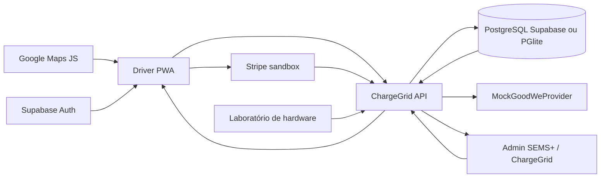
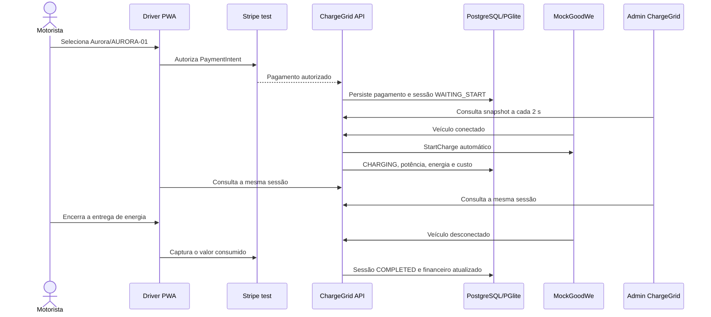

# ChargeGrid Intelligence

Protótipo funcional da Sprint 3 que integra a jornada do motorista à operação comercial de recarga incorporada ao Admin SEMS+.

O motorista descobre o Hub Solar Aurora, escolhe ou identifica um carregador, autoriza um pagamento Stripe em modo de teste e acompanha a recarga. A API mantém uma única sessão comercial persistida; Operação, Sessões, Fila e Resumo financeiro do Admin observam os mesmos registros. Somente a fronteira física GoodWe/HCA G2 é simulada.

Esta entrega dá continuidade à [Sprint 2 — Dashboard Comercial ChargeGrid](https://github.com/PtiagoM/Dashboard_Comercial-ChargeGrid), que definiu a proposta, a arquitetura e a experiência administrativa. A Sprint 3 concentra-se na implementação funcional e na integração executável entre os componentes.

## Entrega acadêmica

**Sprint 3 — Prototipagem Funcional e Integração**

| Equipe | RM |
| --- | --- |
| Tiago Pimentel Muniz | 574148 |
| Gustavo Curis de Francisco | 569704 |
| Caio César Portela França | 573127 |
| Lourenço Borges da Silva | 569515 |
| Davi Teodoro Novais | 571022 |

O objetivo é demonstrar um sistema operacional, com partes reais e simuladas claramente identificadas, no qual descoberta, pagamento, automação do carregador, medição energética e gestão comercial atuam sobre uma única sessão persistida.

> Leia primeiro [`docs/CURRENT_STATE.md`](docs/CURRENT_STATE.md). O recorte executável, as evidências e o roteiro da Sprint estão em [`docs/SPRINT3.md`](docs/SPRINT3.md).

## Arquitetura executável



- PWA e Admin são interfaces distintas sobre a mesma API e os mesmos registros.
- Polling de aproximadamente dois segundos apenas consulta; energia e custo avançam no relógio da API.
- O laboratório `/admin` emite eventos físicos sobre os carregadores persistidos. Conectar um veículo a uma sessão autorizada dispara `StartCharge` automaticamente; ele não cria pagamento, receita ou sessão fictícia.
- O botão **Reiniciar dados de teste** limpa sessões, pagamentos, fila, atribuições e telemetria do Aurora sem recriar o catálogo.
- A API usa o PostgreSQL remoto quando `CHARGEGRID_DATABASE_URL` está configurado e mantém PGlite persistente em `.local/commercial-db` como fallback. Neste ambiente, a aplicação remota das migrations está bloqueada por falta de autenticação da Supabase CLI.

### Fluxo funcional integrado



## O que funciona

- catálogo compartilhado do Hub Solar Aurora e carregadores `AURORA-01` a `AURORA-06`;
- descoberta normal pela PWA, detalhe do local, QR e código operacional manual;
- Payment Element e PaymentIntent reais no Stripe test, com captura manual de cartão ao encerrar;
- uma sessão persistida e compartilhada entre PWA, API e Admin;
- ciclo físico `AVAILABLE → CONNECTED → CHARGING → AVAILABLE`;
- energia coerente (`potência × tempo`), custo pela tarifa congelada e teto financeiro;
- Admin ChargeGrid em Operação, Sessões, Fila e Resumo financeiro;
- fila persistida, uma entrada ativa por motorista, chamada FIFO por estabelecimento e atribuição temporária de dez minutos;
- atualização automática e recuperação após reload/reinício da API;
- estados de falha/offline e recuperação emitidos pelo laboratório GoodWe simulado.

## Integrações e limites

| Camada | Classificação | Estado |
| --- | --- | --- |
| Driver PWA, Admin e API | Real no protótipo | React/Vite + Express, integrados pelo contrato compartilhado |
| Stripe | Real em sandbox | PaymentIntent, Payment Element, autorização e captura de cartão validados |
| Supabase Auth | Real quando configurado | Cadastro/login da PWA; fallback local somente para desenvolvimento |
| Google Maps | Real quando configurado | Fluxo e SDK preservados; exige `VITE_GOOGLE_MAPS_API_KEY` válida |
| Banco comercial | Real, com fallback local | PostgreSQL remoto por `CHARGEGRID_DATABASE_URL`; PGlite persistente quando a URL não está disponível; não usa JSON |
| Supabase PostgreSQL remoto | Preparado, não aplicado | Projeto alcançável, mas sem tabelas comerciais; falta login/token da CLI para `db push` |
| GoodWe/HCA G2 | Simulado | Laboratório e `MockGoodWeProvider` substituem somente hardware/telemetria |
| Stripe live, GoodWe OpenAPI e HCA G2 físico | Conceitual | Fora do escopo e não apresentados como produtivos |

## Justificativa técnica

| Escolha | Motivo |
| --- | --- |
| Dois frontends React sobre uma API Express | Preserva as jornadas específicas de motorista e estabelecimento sem duplicar a regra comercial |
| Contratos TypeScript compartilhados | Mantém PWA, API e Admin alinhados nos mesmos estados, IDs e formatos |
| PostgreSQL/Supabase com fallback PGlite | Usa modelo relacional real e persistente, mas mantém a demonstração executável sem depender da infraestrutura remota |
| Stripe Payment Element em modo teste | Demonstra autorização e captura reais sem movimentar dinheiro nem simular aprovação financeira |
| Polling de 2 segundos | Entrega atualização automática estável para o protótipo, sem introduzir a complexidade de Realtime |
| `MockGoodWeProvider` | Substitui somente o hardware indisponível e mantém a fronteira preparada para um provider GoodWe futuro |

## Resultados e dados funcionais

- seis carregadores persistidos (`AURORA-01` a `AURORA-06`) compartilham os mesmos IDs entre mapa, QR, PWA, API, Admin e laboratório;
- sessões exibem estado, potência instantânea, energia em kWh, tarifa, custo e pagamento relacionado;
- a energia é calculada no backend por `energia = potência × tempo`; o custo deriva da tarifa aceita e respeita o limite autorizado;
- a sessão de validação `CG-868A92DC` registrou 21,05 kWh, R$ 40,00 e um PaymentIntent Stripe test capturado, aparecendo nas mesmas telas de Operação, Sessões e Resumo financeiro;
- a fila persiste uma única entrada ativa por motorista e chama o primeiro elegível quando o laboratório libera um carregador;
- eventos `OFFLINE`, `FAULT` e `RECOVER` permitem demonstrar exceções sem criar sessões ou receitas artificiais.

## Estrutura

```text
apps/
  admin-web/       Admin SEMS+ com superfícies ChargeGrid e laboratório físico
  driver-pwa/      jornada mobile normal do motorista
  api/             pagamentos, sessões, fila, telemetria e persistência
packages/shared/   enums e contratos compartilhados
supabase/migrations/
  202609220001_commercial_core.sql
  202609220002_hardware_lifecycle.sql
  202609220003_commercial_queue.sql
docs/
  CURRENT_STATE.md
  SPRINT3.md
```

## Pré-requisitos

- Node.js 20 ou superior;
- npm 10 ou superior;
- chaves Stripe de teste para pagamento real em sandbox;
- chave Google Maps JavaScript API para exibir o mapa real;
- projeto Supabase para Auth, se o login remoto da PWA for demonstrado.

## Configuração

```bash
npm install
cp .env.example .env
```

Preencha localmente, sem versionar segredos:

- `VITE_CHARGEGRID_API_URL=http://localhost:3333`
- `VITE_GOOGLE_MAPS_API_KEY`
- `VITE_STRIPE_PUBLISHABLE_KEY`
- `STRIPE_SECRET_KEY`
- `STRIPE_WEBHOOK_SECRET` quando webhooks forem exercitados
- `VITE_SUPABASE_URL` e `VITE_SUPABASE_ANON_KEY` para Auth remoto
- `SUPABASE_URL` e `SUPABASE_SERVICE_ROLE_KEY` somente no servidor, quando necessários
- `CHARGEGRID_DATABASE_URL` para tornar o PostgreSQL/Supabase remoto a autoridade comercial; sem ela, a API usa PGlite

Para provisionar o schema remoto após autenticar a CLI:

```bash
npx supabase login
npx supabase link --project-ref <project-ref>
npx supabase db push --include-seed
```

`supabase/seed.sql` é idempotente e preserva os IDs estáveis de `AURORA-01` a `AURORA-06`.

## Execução

```bash
npm run dev
```

- Admin: `http://localhost:5173`
- Driver PWA: `http://localhost:5174`
- API/health: `http://localhost:3333/health`

Processos também podem ser iniciados separadamente com `npm run dev:admin`, `npm run dev:pwa` e `npm run dev:api`.

Contas demonstrativas do Admin:

- estabelecimento Aurora: `aurora@teste.com` / `teste`;
- Central GoodWe: `goodwe@teste.com` / `teste`.

Na PWA, crie uma conta de motorista ou use uma conta Supabase Auth já cadastrada. O cartão Stripe de teste recomendado é `4242 4242 4242 4242`, com validade futura e CVC de três dígitos.

## Jornada principal

1. No Laboratório de hardware, use **Reiniciar dados de teste**; depois abra o Admin com a conta Aurora em ChargeGrid → Operação.
2. Abra a PWA, use o mapa/detalhe do Hub Solar Aurora e escolha `AURORA-01`.
3. Aceite as condições e autorize o limite pelo Payment Element Stripe.
4. Confirme no Admin o mesmo carregador em espera e a mesma sessão.
5. No Admin, abra **Laboratório de hardware** e conecte o veículo; a API envia `StartCharge` automaticamente na potência escolhida.
6. Observe PWA, Operação e Sessões atualizarem automaticamente energia, potência e custo.
7. Encerre a energia na PWA, desconecte o veículo no laboratório e confirme a retirada/liquidação na PWA.
8. Confira a sessão concluída, o carregador disponível e o pagamento capturado no Resumo financeiro.

A jornada de fila e o roteiro cronometrado de até cinco minutos estão em [`docs/SPRINT3.md`](docs/SPRINT3.md).

## Qualidade

```bash
npm run lint
npm run typecheck
npm test
npm run build
npm run test:e2e:sprint3
```

`npm run test:e2e` mantém a regressão ampla do Admin. O E2E Sprint 3 protege QR/código, falha física, fila PWA ↔ API ↔ Admin, polling e reload. A confirmação Stripe real foi validada manualmente porque depende do sandbox externo.

## Limitações conhecidas

- Google Maps exige chave válida, cota e restrições de origem compatíveis com o endereço usado na gravação;
- as migrations remotas ainda precisam ser aplicadas com uma Supabase CLI autenticada e a API precisa de `CHARGEGRID_DATABASE_URL`; o fallback local persiste entre reload e reinício;
- Pix autoriza no Stripe test, mas o encerramento persistido após reembolso ainda não possui a mesma validação ponta a ponta do cartão;
- não há GoodWe OpenAPI, HCA G2 físico, Stripe live, push remoto, RLS/IAM corporativo completo ou operação multi-instância;
- o build do Admin mantém um aviso não bloqueante de chunk acima de 500 kB.

## Relação com energia e automação

O protótipo relaciona operação comercial e eficiência energética sem inventar integração física: a telemetria simulada define conexão, potência, falha e entrega; a API transforma potência e tempo em energia, deriva o custo pela tarifa aceita e mantém o teto autorizado. Essa fronteira permite substituir o mock por GoodWe real futuramente sem duplicar regras na PWA ou no Admin.

Na disciplina, a implementação evidencia:

- **energia renovável e eficiência:** potência, tempo, energia entregue e custo são relacionados por medições coerentes e por um limite financeiro;
- **automação inteligente:** autorização financeira e conexão física válidas disparam `StartCharge` automaticamente;
- **integração de sistemas:** Maps, PWA, Stripe, API, banco, Admin e simulador GoodWe trocam dados por contratos explícitos;
- **coleta e visualização:** telemetria e eventos persistidos aparecem automaticamente nas interfaces do motorista e do estabelecimento;
- **decisão operacional:** disponibilidade, falha, ocupação e fila alteram o comportamento comercial usando o mesmo estado compartilhado.

## Material da apresentação

O [documento da Sprint 3](docs/SPRINT3.md) contém o roteiro técnico cronometrado de até cinco minutos, a matriz real/sandbox/simulado, o checklist dos requisitos e as evidências de validação. O vídeo deve demonstrar a jornada normal do produto, sem utilizar uma aplicação paralela de demonstração.
