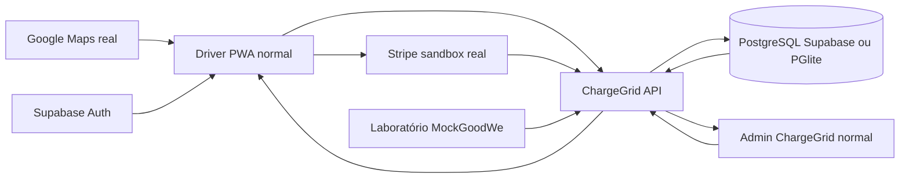

# Sprint 3 — Prototipagem Funcional e Integração

Atualizado em 22/09/2026. Registro vigente da entrega; complementa `CURRENT_STATE.md`.

## Correção de direção e Marco 1

O fluxo `/demo` abaixo registra a prova de conceito anterior, mas não representa mais a arquitetura-alvo. A demonstração final usa as telas normais e uma única operação comercial persistida.

Marco 1 validado:

- migration PostgreSQL mínima para estabelecimentos, carregadores, sessões e pagamentos;
- catálogo compartilhado do Hub Solar Aurora, incluindo o código operacional `AURORA-01`;
- checkout normal da PWA com Payment Element e PaymentIntent Stripe test real;
- sessão e pagamento vinculados no banco e promovidos para `WAITING_START` após confirmação do Stripe;
- PWA e Admin atualizados por polling de dois segundos sobre a mesma API;
- Admin `Operação` exibe AURORA-01 aguardando conexão e `Sessões` exibe o mesmo ID, motorista, carregador e pagamento;
- reload da PWA/Admin e reinício da API preservam o estado.

Evidência focal: 18 testes da API, teste de projeção do snapshot no Admin e builds de API, Admin e PWA aprovados. A jornada também foi executada em navegador real com cartão Stripe de teste.

Marco 2 validado:

- o laboratório `/admin` foi convertido em fronteira de hardware/GoodWe simulada e usa os mesmos carregadores da operação comercial;
- conexão, StartCharge automático, potência configurável, parada, desconexão, offline, falha e recuperação passam pela API e pelo banco normal;
- um relógio da API acumula `energia = potência × tempo`; polling de PWA/Admin somente observa;
- o teto autorizado limita simultaneamente custo e energia, inclusive ao recuperar uma sessão após reinício;
- a PWA normal encerra a entrega, captura o PaymentIntent real em teste e recebe `COMPLETED` com comprovante;
- o término preserva a sequência física e financeira: `CHARGING → ENERGY_FINISHED → DISCONNECT → COMPLETED`; o Admin exibe `ENERGY_FINISHED` como **Recarga finalizada**, nunca como aguardando início;
- Admin `Operação`, `Sessões` e `Resumo financeiro` exibem o mesmo carregador, sessão e PaymentIntent, com atualização a cada dois segundos;
- os controles de cenário demonstrativo foram removidos de `ChargeGrid > Operação`.

Evidência visual: a sessão `CG-868A92DC` no carregador `AURORA-01` avançou até `CHARGING`, encerrou com 21,05 kWh/R$ 40,00, capturou `pi_3UIO8b1zxDyq7sgU0SsaCvFU` no Stripe test e apareceu como finalizada/capturada no Admin. O carregador voltou a `AVAILABLE_TO_START`.

Marco 3 validado:

- migration `202609220003_commercial_queue.sql` persiste a fila e garante no banco uma única entrada ativa por motorista autenticado;
- PWA normal entra, consulta e sai da fila pela API; posição, chamada e carregador atribuído são atualizados automaticamente a cada dois segundos;
- Admin `Fila` projeta as mesmas entradas persistidas e calcula a posição dentro do estabelecimento;
- liberar um carregador pelo laboratório chama o primeiro motorista elegível e mantém o equipamento temporariamente atribuído por dez minutos;
- a atribuição autoriza o checkout normal no carregador chamado; sair da fila libera o carregador se não houver sessão ativa.

Evidência visual: com os seis carregadores Aurora conectados, `Motorista Fila Browser` entrou como `WAITING`, apareceu no Admin, recebeu `AURORA-03` após o evento físico `DISCONNECT`, apareceu como chamado nas duas interfaces e preservou o estado após reload. A saída removeu a fila ativa e devolveu AURORA-03 a `AVAILABLE_TO_START`.

Marco 4 validado no recorte necessário à gravação:

- QR, URL e entrada manual aceitam o código operacional e resolvem o mesmo `chargerId` usado pela API, banco e Admin;
- a landing QR observa disponibilidade, offline/falha e recuperação pelo snapshot comercial, inclusive após reload;
- o cache do service worker exclui `/api/*`, evitando reexibir snapshot comercial obsoleto quando API e PWA compartilham a origem;
- recuperação de pagamento, sessão, fila e atribuição após reload permanece coberta pelos fluxos normais já validados.

Evidência visual: `AURORA-01` digitado no scanner abriu `/qr/AURORA-01`; um evento `OFFLINE` apareceu como falha na PWA, permaneceu após reload e voltou a disponível depois de `RECOVER`, sem atualização manual.

Limitação do ambiente: o projeto Supabase remoto responde, mas ainda não possui as tabelas comerciais (`PGRST205`). A migration não pôde ser aplicada sem login/token de plataforma da CLI nem URL SQL; o fallback executável é PostgreSQL local persistente via PGlite, não JSON. A chave Maps existe apenas no `.env` local e ainda depende de cota/restrições válidas para a gravação.

## Auditoria de partida

- Base limpa: `develop/admin-web`, commit `c8cc21c`, PR #16 integrada. Referências remotas atualizadas por fetch.
- Branch de trabalho: `feature/admin-sprint3-integration`, derivada exatamente dessa base. Escopo transversal solicitado: Admin, PWA, API e contratos compartilhados.
- Admin: React/TypeScript nativo, comandos, sessões, fila, permissões demonstrativas, financeiro e relatórios. Persistência e adapters operacionais exclusivamente locais.
- PWA: QR, catálogo, mapa, identidade local/Supabase, Stripe sandbox, sessões/fila/comprovantes locais. Não compartilha sessões com o Admin.
- API: Express/TypeScript, saúde e pagamentos Stripe sandbox; GoodWe é um adapter não conectado. Não há tabelas comerciais ou RLS Supabase implementadas.
- Lacunas verificadas: simulador Admin alterava somente badge; métricas gráficas eram fixtures; PWA perdia recuperação de pagamento e sessão em alguns fluxos; ausência de testes de integração entre os dois produtos.
- Validação de partida: `npm run lint`, `npm test` (88 testes) e `npm run build` aprovados. Aviso de chunk Admin acima de 500 kB, sem erro de build.
- GitHub CLI sem autenticação. Não impede trabalho/commits locais; publicação e merge não fazem parte desta execução.

## Decisão de escopo

A prioridade vigente é demonstrar uma sessão compartilhada por API, desktop e mobile, com simulação explícita e reproduzível quando não existe hardware ou serviço externo disponível. Não reconstruir novamente a interface SEMS+, não afirmar homologação GoodWe e não misturar uma autorização financeira simulada com PaymentIntents Stripe reais em teste.

As listas visuais F0–F7 anteriores continuam referências de evolução do produto, não a definição de pronto da Sprint 3.

## Prova de conceito anterior — retirada

O antigo `/demo` comprovou cálculos e integração em processo único, mas criava uma segunda operação comercial. Após as verticais normais ficarem verdes, foram removidos:

- rota PWA `/demo` e seus CTAs;
- endpoints API `/demo/*`, runtime e persistência `.local/demo/state.json`;
- scripts, variáveis de ambiente e E2E exclusivos do runtime paralelo;
- contratos `DemoRuntime*` sem consumidores.

Permanecem apenas fixtures estáticas úteis ao `MockGoodWeProvider`; elas não criam sessão, pagamento ou estado comercial. O `/admin` foi preservado e renomeado para **Laboratório de hardware**: seus controles emitem somente eventos físicos pela API comercial normal.

Evidência da retirada: `/demo/state` responde 404, navegar para `/demo` na PWA retorna à home e o laboratório `/admin` lê `AURORA-01` do snapshot comercial inclusive após reload.

## Limites preservados

- GoodWe/HCA G2 continuam simulados; não há homologação ou hardware real.
- Não foram executados push, publicação ou integração em `develop/admin-web`/`main`.
- A PWA ainda não possui suíte unitária própria; suas jornadas críticas estão protegidas pelo E2E integrado da Sprint 3.

## Arquitetura final executável

O banco contém estabelecimentos, carregadores, sessões, pagamentos e fila. PWA e Admin não mantêm motores comerciais próprios. O laboratório substitui apenas eventos físicos e usa as mesmas entidades. O catálogo compartilhado resolve mapa, QR e código operacional no mesmo `chargerId`.

## Matriz possível versus ideal

| Parte | Estado final da Sprint 3 |
| --- | --- |
| Frontends, API e contratos | Implementados no repositório |
| Stripe | Real em modo de teste; cartão autorizado e capturado |
| Google Maps | Implementado com SDK real; gravação depende de chave válida |
| Supabase Auth | Real quando as variáveis estão configuradas |
| Persistência comercial | PostgreSQL remoto quando `CHARGEGRID_DATABASE_URL` existe; PGlite persistente como fallback |
| Supabase PostgreSQL remoto | Projeto validado; tabelas ausentes e aplicação bloqueada pela autenticação da CLI |
| GoodWe/HCA G2 | Simulado exclusivamente na fronteira física |
| GoodWe OpenAPI, hardware físico e Stripe live | Não implementados e não alegados |

## Roteiro de gravação — até 5 minutos

Preparação: configure Google Maps/Stripe, inicie `npm run dev`, clique **Reiniciar dados de teste** no laboratório, autentique a PWA e abra o Admin com `aurora@teste.com` / `teste`.

1. **0:00–0:35 — problema e arquitetura.** Explique que o ChargeGrid adiciona operação comercial à infraestrutura energética GoodWe. Mostre rapidamente o diagrama acima e diferencie Stripe/Maps reais, banco local persistente e hardware simulado.
2. **0:35–1:15 — descoberta normal.** Na PWA, abra o mapa, selecione Hub Solar Aurora e `AURORA-01`. Mostre código, vaga, potência, preço e condições. Como alternativa técnica, digite `AURORA-01` no scanner e mostre que chega ao mesmo carregador.
3. **1:15–2:05 — pagamento e sessão única.** Escolha cartão, limite de R$ 40,00 e use `4242 4242 4242 4242`. Após autorizar, mostre a sessão na PWA e, sem reload, AURORA-01 em espera em Operação e o mesmo ID em Sessões.
4. **2:05–3:05 — hardware e energia.** Abra o Laboratório de hardware, selecione 7 kW e conecte AURORA-01. Mostre o `StartCharge` automático e volte a Operação/Sessões e à PWA para mostrar `CHARGING`, potência, energia e custo avançando pelo relógio da API.
5. **3:05–3:45 — encerramento e financeiro.** Encerre na PWA. Mostre `COMPLETED`, carregador disponível e o mesmo PaymentIntent/valor capturado no Resumo financeiro.
6. **3:45–4:35 — fila compartilhada.** No laboratório, conecte todos os carregadores. Na PWA, entre na fila; no Admin, mostre o motorista. Desconecte um carregador, aguarde o polling e mostre a atribuição temporária nas duas interfaces.
7. **4:35–5:00 — fechamento técnico.** Reforce que polling apenas observa, regras ficam na API, Stripe é sandbox real e GoodWe é o único trecho simulado. Cite as limitações sem alegar produção.

## Checklist explícito da Sprint 3

| Requisito | Estado | Evidência |
| --- | --- | --- |
| PWA normal integrada à API | Atendido | mapa/detalhe, QR, checkout, sessão e fila usam serviços comerciais |
| Admin Operação e Sessões compartilham a sessão | Atendido | snapshot comercial e polling de 2 s |
| Fila PWA ↔ Admin | Atendido | migration 003, endpoints e E2E Sprint 3 |
| Resumo financeiro deriva do pagamento | Atendido | sessão `CG-868A92DC` e PaymentIntent Stripe capturado |
| Persistência após reload/reinício | Atendido localmente | PGlite em `.local/commercial-db` e testes de reload |
| Catálogo/código/QR únicos | Atendido | `AURORA-01` a `AURORA-06` em banco, PWA, Admin e laboratório |
| Stripe real em teste | Atendido | Payment Element, autorização e captura reais |
| Google Maps real | Parcial no ambiente | integração implementada; falta chave válida local para a gravação |
| Supabase/PostgreSQL remoto | Parcial | migrations prontas; fallback PostgreSQL local ativo |
| Hardware GoodWe | Atendido como simulação declarada | laboratório `/admin` e MockGoodWeProvider |
| Estados normais e falhas | Atendido | conexão, carga, stop, offline, falha e recuperação |
| Runtime comercial `/demo` retirado | Atendido | rota/UI/API/JSON/scripts removidos; `/demo/state` retorna 404 |
| Testes, lint, typecheck e builds | Atendido | comandos e resultados registrados abaixo |

## Validação final

- `npm run lint` — aprovado;
- `npm run typecheck` — aprovado;
- API — 14/14 testes aprovados;
- Shared — 5/5 testes aprovados;
- Admin — 78/78 testes aprovados;
- `npm run build` — aprovado; aviso conhecido de chunk do Admin acima de 500 kB;
- `npm run test:e2e:sprint3` — 2/2 cenários aprovados no Chromium (QR/falha/recuperação e fila PWA ↔ Admin com reload);
- Stripe test — jornada manual real aprovada com autorização e captura;
- `npm run test:e2e` — 57/57 cenários da regressão ampla do Admin aprovados no Chromium.
